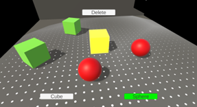

# 🌊 Upgradation of AR-Based Interactive & Procedural Marine Ecosystem (Entry Task)

## 📌 Overview

This repository contains my **entry task submission** for the **Catrobat GSoC 2026 Project Proposal**:
**“Upgradation of AR-Based Interactive and Procedural Marine Ecosystem Simulation.”**

The goal of this task was to demonstrate:

* Basic **AR interaction understanding**
* Ability to build a **minimal working prototype**
* Clear and reproducible **documentation**

This prototype also serves as a **proof-of-concept (POC)** for a larger ecosystem simulation described in my proposal .

---

## 🎯 Entry Task Objective

Implement a simple AR interaction:

> Spawn an object on user tap in a real-world surface

---

## 🧪 Prototype Description

This Unity-based AR prototype demonstrates:

* 📱 **Tap-to-Spawn Interaction**
* 🧱 AR plane detection and object placement
* 🌊 Early simulation elements using primitive objects:

  * 🟦 Cubes → Coral
  * ⚪ Capsules → Fish
  * 🟣 Sphere → Octopus
  * ⬛ Plane → Seabed

---

## 🧭 Scenes Overview

This project is organized into two main Unity scenes:

### 🎯 EntryTask Scene

* Focus: **Minimal AR interaction (required task)**

* Demonstrates:

  * AR plane detection
  * Tap-to-spawn object placement

* Purpose:

  * Directly fulfills the **entry task requirement**
  * Shows understanding of **AR interaction fundamentals**

---

### 🌊 SimTest Scene

* Focus: **Extended simulation prototype (POC)**

* Demonstrates:

  * Procedural seabed layout
  * Fish boids behavior
  * Octopus detection and chase logic
  * Coral interaction system

* Purpose:

  * Validates **core mechanics** of the proposed ecosystem
  * Demonstrates readiness for **full-scale implementation**

---

> 💡 Evaluators can open:
>
> * `EntryTask` → Required AR functionality
> * `SimTest` → Extended simulation capabilities

---

## ⚙️ How It Works

1. The app detects real-world surfaces using **AR Foundation**
2. On user tap:

   * A raycast is fired onto detected planes
   * If a plane is detected → object is spawned
3. Spawned objects act as placeholders for simulation entities

---

## 🚀 Features Demonstrated

* ✅ AR Plane Detection
* ✅ Tap-based Object Placement
* ✅ Scene-based modular design
* ✅ Prototype ecosystem components

---

## 🧠 Extended POC (Beyond Entry Task)

To validate feasibility of the full proposal, the prototype includes:

* 🐟 **Fish Boids Behavior** (alignment, cohesion, separation)
* 🐙 **Octopus Detection & Chase System**
* 🌿 **Coral Feeding Constraints**
* 🗺️ **Procedural Biome Distribution**

  * Sand (40%)
  * Coral (40%)
  * Hiding Zones (20%)

---

## 🛠️ Tech Stack

* **Engine:** Unity
* **AR Framework:** AR Foundation (ARCore + ARKit)
* **Language:** C#
* **Platform:** Android / iOS

---

## 📂 Project Structure

```
Assets/           → Scripts, prefabs, AR logic  
Packages/         → Unity dependencies  
ProjectSettings/  → Unity configuration  
Assets/Scenes/    → EntryTask & SimTest scenes  
```

---

## ▶️ How to Run

1. Clone the repository:

   ```bash
   git clone https://github.com/joshi-p/Procedural-mARine-Demo.git
   ```

2. Open in **Unity**

3. Open desired scene:

   * `EntryTask` → for evaluation task
   * `SimTest` → for extended simulation

4. Ensure:

   * AR Foundation installed
   * ARCore (Android) or ARKit (iOS) enabled

5. Build & run on a **physical device**

> One may test in the editor itself by reviewing **Entry Task Video Demo.mp4** and **Simulation Test Video Demo.mp4**

---

## 📸 Demo

### 🧪 Image 1: Entry Task Snapshot



* Demonstrates **tap-to-spawn interaction**
* UI controls for spawning and deleting objects
* Basic AR interaction prototype using primitive objects

---

### 🌊 Image 2: Simulation Test Snapshot


* Shows **procedural distribution of ecosystem elements**
* Includes fish (white), coral (green), and octopus (pink)
* Demonstrates early-stage **ecosystem behavior simulation**


---

## 📈 Future Scope (Proposal Alignment)

This prototype is the foundation for the full system proposed in GSoC 2026:

* 🌍 Procedural marine biome generation
* 🧬 Genetic evolution & natural selection
* 🦈 Multi-species ecosystem (fish, sharks, octopus)
* ☁️ Firebase-based persistence & classroom sharing

---

## 👤 Author

**Prabhakar Joshi**

* GitHub: https://github.com/joshi-p
* LinkedIn: https://linkedin.com/in/prabhakar-joshi-48424b25b/

---

## 🙌 Acknowledgment

This work is part of my application to the
**International Catrobat Association – GSoC 2026**

---

## ⭐ Notes for Evaluators

* Scenes are intentionally separated for **ease of testing**
* Uses simple primitives to validate logic before asset integration
* Includes extended systems to demonstrate **readiness for scale**

---
